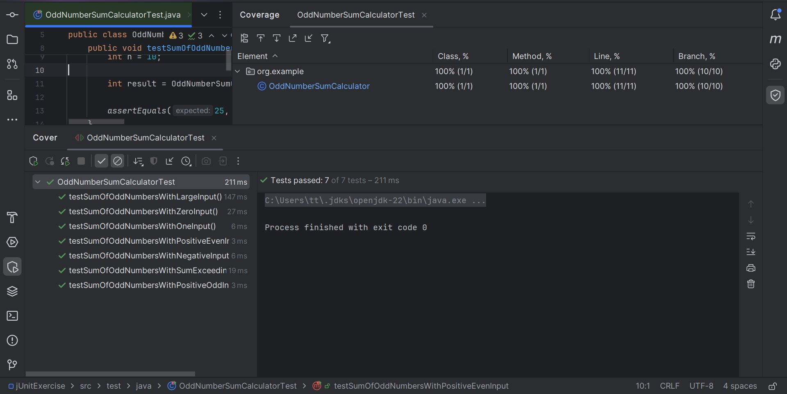

## Đây là bài thực hành nhỏ với kiểm thử đơn vị JUnit.
- Chương trình chính là một chương trình tính toán tổng của số lẻ từ 1 đến n với n là giá trị mà người dùng nhập vào.
- Chúng tôi đã sử dụng Coverage để đo độ bao phủ mã đạt được trong mã của chương trình chính.

Dưới đây là mô tả về chương trình:
- Đoạn code chính:
```java
package org.example;

public class OddNumberSumCalculator {
    public static int sumOfOddNumbers(int n)
    {
        if (n < 0)
        {
            throw new IllegalArgumentException("n phải là một số không âm");
        }
        if (n >= Integer.MAX_VALUE - 1)
        {
            throw new IllegalArgumentException("n quá lớn để tính toán");
        }
        long sum = 0;
        for (int i = 0; i <= n; i++)
        {
            if (i%2 != 0) {
                sum += i;
            }
        }
        if (sum > Integer.MAX_VALUE)
        {
            throw new ArithmeticException("Tổng vượt quá giới hạn của kiểu int");
        }
        return (int)sum;
    }
}
```
Chúng đã xây dựng các mã để kiểm thử chương trình trên sử dụng JUit, dưới đây là chi tiết về mã kiểm thử:
```java
public class OddNumberSumCalculatorTest {

    @Test
    public void testSumOfOddNumbersWithPositiveEvenInput() {
        int n = 10;

        int result = OddNumberSumCalculator.sumOfOddNumbers(n);

        assertEquals(25, result);
    }

    @Test
    public void testSumOfOddNumbersWithPositiveOddInput() {
        int n = 15;

        int result = OddNumberSumCalculator.sumOfOddNumbers(n);

        assertEquals(64, result);
    }

    @Test
    public void testSumOfOddNumbersWithZeroInput() {
        int n = 0;

        int result = OddNumberSumCalculator.sumOfOddNumbers(n);

        assertEquals(0, result);
    }

    @Test
    public void testSumOfOddNumbersWithOneInput() {
        int n = 1;

        int result = OddNumberSumCalculator.sumOfOddNumbers(n);

        assertEquals(1, result);
    }

    @Test
    public void testSumOfOddNumbersWithNegativeInput() {
        int n = -5;

        assertThrows(IllegalArgumentException.class, () -> {
            OddNumberSumCalculator.sumOfOddNumbers(n);
        });
    }

    @Test
    public void testSumOfOddNumbersWithLargeInput() {
        int n = Integer.MAX_VALUE;

        assertThrows(IllegalArgumentException.class, () -> {
            OddNumberSumCalculator.sumOfOddNumbers(n);
        });
    }

    @Test
    public void testSumOfOddNumbersWithSumExceedingIntegerMaxValue() {
        int n = 500000; // Chọn một giá trị lớn đủ để vượt quá giới hạn của kiểu int

        assertThrows(ArithmeticException.class, () -> {
            OddNumberSumCalculator.sumOfOddNumbers(n);
        });
    }
}
```
Sau đó chúng tôi đã thử chạy nó với công cụ tính độ bao phủ dòng lệnh Coverage, kết quả chạy được hiển thị chi tiết trong ảnh dưới đây:
- 